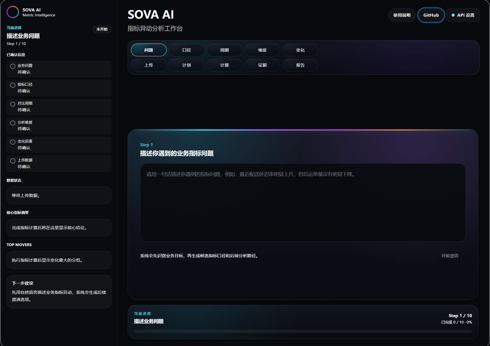

# SOVA AI｜指标异动分析工作台

> 把一句模糊的业务问题，转成可计算、可复查、可汇报的指标异动分析流程。

## 在线体验

👉 **立即使用：** https://sova-ai-ten.vercel.app/

建议使用流程：

1. 打开网站
2. 点击右上角 **API 设置**
3. 填入自己的 API Key、模型名称和 API Base URL
4. 从 Step 1 开始输入业务指标问题
5. 上传数据后，按流程生成分析计划、指标计算、可视化分析、证据链和报告草稿

AI 相关功能需要用户自行配置 API Key。

---

SOVA AI 是一个面向 **数据分析 / 商业分析 / AI 产品展示** 的指标异动分析工作台。  
它可以帮助用户从“最近转化率下降了”“胜率为什么突然变低”“SLA 超时率为什么升高”这类模糊问题出发，逐步确认指标口径、上传数据、执行聚合计算，并生成 Top movers、可视化拆解、证据链和报告草稿。
## 界面预览

### 深色 AI 指标分析工作台



---

## SOVA AI 解决什么问题？

在真实业务分析中，很多需求一开始并不是清晰的 SQL 题，而是一句很模糊的话：

```text
最近转化率下降了，帮我看看是不是渠道、设备、页面加载导致的。
```

或者：

```text
这周胜率为什么突然下降？
客服 SLA 超时率最近为什么变高？
物流配送延迟率是不是某些仓库或天气因素导致的？
```

这类问题真正难的地方不是“写一条 SQL”，而是先把问题拆清楚：

- 到底要分析什么指标？
- 指标口径是什么？
- 分子和分母分别是什么？
- 应该比较哪个时间段？
- 应该按哪些维度拆解？
- 哪些分组变化最大？
- 哪些辅助指标能支持判断？
- 最后如何整理成可复查的分析结论？

SOVA AI 的目标就是把这个过程产品化，让用户从一个模糊问题开始，逐步得到结构化、可解释的分析结果。

---

## 核心流程

SOVA AI 的分析流程如下：

```text
业务问题
→ 指标口径确认
→ 对比周期选择
→ 分析维度选择
→ 数据上传
→ 字段语义识别
→ Metric Spec 生成
→ DuckDB 指标计算
→ 主指标结果
→ Top movers
→ 可视化分析
→ 证据链生成
→ 报告草稿生成
```

这个流程强调三点：

1. **先理解业务问题**
2. **再生成可控的指标计算规格**
3. **最后用数据结果生成证据链和报告**

相比直接让 AI 随便写 SQL，这种方式更安全，也更适合真实的数据分析工作流。

---

## 产品工作流

当前产品采用 Step 1–10 的分步式工作流：

```text
Step 1  描述业务问题
Step 2  确认指标口径
Step 3  确认对比周期
Step 4  确认分析维度
Step 5  确认近期变化因素
Step 6  上传数据
Step 7  生成分析计划
Step 8  执行指标计算与可视化分析
Step 9  生成证据链
Step 10 生成报告草稿
```

每一步都会逐步减少问题的不确定性，让用户从“我感觉某个指标变差了”走到“我知道哪些分组变化最大，并且有证据支持这个判断”。

---

## 核心能力

### 1. 业务问题澄清

用户只需要输入一句自然语言业务问题。  
系统会帮助识别：

- 分析目标
- 指标名称
- 可能的指标口径
- 分子字段
- 分母字段
- 时间字段
- 推荐拆解维度
- 可能的变化因素

---

### 2. 指标口径确认

SOVA AI 不会直接跳到计算，而是先帮助用户确认指标口径。

例如：

```text
转化率 = 转化人数 / 总访问人数
激活率 = 激活用户数 / 新注册用户数
SLA 超时率 = 超时工单数 / 总工单数
胜率 = 胜场数 / 总场数
```

这样可以减少“指标定义不清楚”带来的分析偏差。

---

### 3. Metric Spec 驱动计算

SOVA AI 会将用户确认后的分析需求转成结构化 Metric Spec。

Metric Spec 通常包括：

- 指标名称
- 指标公式
- 分子字段
- 分母字段
- 时间字段
- 对比周期
- 拆解维度
- 辅助指标字段

这个设计可以让分析计算更可控，而不是让 LLM 自由写 SQL。

---

### 4. DuckDB 安全聚合分析

SOVA AI 使用 DuckDB 执行本地聚合分析，支持：

- 本期 vs 上期指标对比
- 分子 / 分母变化
- 维度拆解
- Top movers
- 辅助指标对比

这样可以让结果更稳定，也更容易复查。

---

### 5. Top Movers 分析

系统会识别导致指标变化最大的分组。

例如：

- 哪个渠道转化率下降最多？
- 哪个仓库延迟率上升最明显？
- 哪个客服团队 SLA 超时率贡献最大？
- 哪张地图胜率下降最明显？
- 哪类设备的转化率变化最异常？

Top movers 可以帮助用户从“指标发生变化”进一步走到“主要变化来自哪里”。

---

### 6. 可视化分析

指标计算完成后，用户可以生成可视化分析。

可视化分析用于帮助用户更直观地理解：

- 整体指标变化
- 分组表现差异
- Top movers
- 辅助指标变化
- 可能的异常模式

在当前产品流程中，可视化分析被作为 Step 8 的重要步骤展示，而不是隐藏在底部的二级功能。

---

### 7. 证据链生成

SOVA AI 会根据计算结果生成证据链。

证据链会把这些内容串起来：

```text
指标变化
→ 主要变化分组
→ 辅助指标对比
→ 支撑性发现
→ 可复查结论
```

它的目的不是直接替代人工判断，而是帮助用户快速形成一组可验证的分析线索。

---

### 8. 报告草稿生成

最后，系统会根据指标结果和证据链生成报告草稿。

报告草稿适合用于：

- 业务复盘
- 小组讨论
- 分析作业
- 面试作品展示
- 后续人工修改

报告内容可以复制出来继续编辑。

---

## 支持场景

SOVA AI 适合分析“某个指标最近变好或变差”的问题。

目前重点测试过的场景包括：

### 物流配送延迟率

```text
配送延迟率 = 延迟配送订单数 / 总配送订单数
```

可用于分析：

- 仓库
- 承运商
- 地区
- 天气
- 包裹大小

---

### SaaS 新用户 7 日激活率

```text
7 日激活率 = 7 日内完成激活的新用户数 / 新注册用户数
```

可用于分析：

- 获客渠道
- 用户套餐
- 注册来源
- 核心配置完成情况
- 产品使用行为

---

### 客服 SLA 超时率

```text
SLA 超时率 = SLA 超时工单数 / 总工单数
```

可用于分析：

- 工单类型
- 客服团队
- 问题类别
- 系统模块
- 处理优先级

---

### Valorant 排位胜率

```text
胜率 = 胜场数 / 总场数
```

可用于分析：

- 地图
- 特工
- 队列类型
- 服务器
- ACS
- K/D

---

### 营销落地页转化率

```text
试用转化率 = 免费试用注册数 / 页面访问人数
```

可用于分析：

- 流量渠道
- 设备类型
- 页面版本
- 跳出行为
- 表单错误
- 加载时间

---

## 与普通 Chat with CSV 的区别

| 对比项 | 普通 Chat with CSV | SOVA AI |
|---|---|---|
| 交互方式 | 用户直接问数据问题 | 先澄清业务目标，再确认指标口径 |
| 计算方式 | 可能依赖 LLM 直接写 SQL | Metric Spec + DuckDB 可控计算 |
| 分析重点 | 回答单个问题 | 完整指标异动排查流程 |
| 输出内容 | 通常是文字解释 | 指标结果、Top movers、可视化、证据链、报告草稿 |
| 可复查性 | 取决于模型输出 | 指标口径和计算过程更结构化 |
| 适用场景 | 临时数据问答 | 业务指标复盘、分析报告、作品集展示 |

---

## UI 设计方向

当前 UI 采用深色 AI 工作台风格。

设计关键词：

- 深色 AI workspace
- 左侧分析驾驶舱
- 右侧主 workflow 区
- 顶部 step navigation
- 彩色 workflow 面板
- 细边框
- 大圆角
- 克制霓虹渐变
- 异步生成过程反馈
- 结果区自动过渡
- 报告预览优化

目标不是做成普通后台管理系统，而是更接近一个可以展示给 HR / 面试官看的 AI 数据分析产品。

---

## 技术架构

```text
Frontend
├── Next.js / React
├── TypeScript
├── Tailwind CSS
├── Workflow UI
├── API Settings
├── Async Process Feedback
├── Evidence Chain Preview
└── Report Draft Preview

Analysis Layer
├── Data Upload
├── Schema Detection
├── Semantic Field Mapping
├── Scenario Profiles
├── Metric Spec Builder
├── Metric Spec Executor
├── DuckDB Aggregation
├── Evidence Chain Generation
└── Report Draft Generation
```

---

## 技术栈

### 前端

- Next.js
- React
- TypeScript
- Tailwind CSS

### 数据分析

- DuckDB
- CSV / Excel 表格数据
- Metric Spec 驱动的聚合分析

### AI / LLM

- 业务问题澄清
- 字段语义识别
- 分析计划生成
- 证据链生成
- 报告草稿生成

---

## 核心设计原则

SOVA AI 的一个重要原则是：**业务理解和数据计算分离**。

```text
LLM 负责：
- 理解业务问题
- 生成澄清路径
- 辅助识别字段语义
- 整理证据链
- 生成报告草稿

DuckDB 负责：
- 指标聚合计算
- 周期对比
- 维度拆解
- Top movers
- 辅助指标对比
```

这种设计可以降低让大模型直接执行自由 SQL 的风险，也更适合做成可复查的数据分析流程。

---

## 快速开始

### 1. 安装依赖

```bash
npm --prefix frontend install
```

### 2. 启动前端

```bash
npm --prefix frontend run dev
```

### 3. 类型检查

Windows PowerShell：

```bash
npm.cmd --prefix frontend run typecheck
```

macOS / Linux：

```bash
npm --prefix frontend run typecheck
```

---

## 环境变量

如需配置 API Key，可以创建：

```bash
frontend/.env.local
```

示例：

```env
OPENAI_API_KEY=your_api_key_here
```

注意：不要提交 `.env` 或 `.env.local`。

---

## 项目结构

```text
Sova-ai
├── frontend
│   ├── app
│   │   └── globals.css
│   ├── components
│   │   ├── metricflow-workspace.tsx
│   │   ├── api-settings.tsx
│   │   ├── evidence-chain.tsx
│   │   ├── report-draft.tsx
│   │   └── analysis-charts.tsx
│   └── ...
├── backend
│   └── ...
├── README.md
├── PROJECT_CONTEXT.md
├── CODEMAP.md
└── UI_REGRESSION_NOTES.md
```

---

## 当前进度

当前版本已经支持从模糊业务问题到报告草稿的完整流程。

已完成能力包括：

- 业务问题澄清
- 指标口径选择
- 对比周期选择
- 分析维度选择
- 数据上传
- 字段语义识别
- Metric Spec 生成
- DuckDB 指标计算
- Top movers
- 辅助指标对比
- 可视化分析
- 证据链生成
- 报告草稿生成
- 异步过程反馈
- 深色 AI 工作台 UI

---

## 版本进展

### MVP 1.0 — 核心流程

完成指标异动分析的基础流程，包括业务问题澄清、指标口径确认、对比周期选择、分析维度选择、数据上传和初步分析链路。

### Workflow 2.0 — 分步式分析流程

将产品重构为 Step 1–10 的引导式工作流，覆盖从业务问题输入到报告草稿输出的完整流程。

### Analysis 3.0 — Metric Spec + DuckDB 计算链路

接入 metric-spec-driven analysis workflow，通过结构化 Metric Spec 和 DuckDB 实现安全、可控的指标计算。

### Result UX 4.0 — 结果展示与证据链流程优化

优化 Step 8–10 的结果体验，让指标结果、可视化分析、证据链和报告草稿都能在对应步骤中清晰展示。

### Scenario 5.0 — 多场景回归测试

完成物流、SaaS、客服 SLA、Valorant、营销转化等多个场景的主流程测试。

### Dark Workspace 6.0 — 深色 AI 工作台 UI

将界面重构为深色 AI workspace，包括左侧分析驾驶舱、右侧主 workflow 区、统一彩色面板和顶部步骤导航。

### Interaction 7.0 — 异步过程反馈与结果过渡

增加 checklist 式 AI 生成过程、结果整理过渡、轻微 reveal 动画，以及生成完成后的结果区自动滚动。

### Report 8.0 — 报告预览优化

优化报告草稿预览格式，提升章节层级、深色卡片排版、中文可读性和复制报告内容体验。

---

## 后续计划

后续可以继续完善：

- 历史分析记录
- 数据文件管理
- 常用指标模板
- 报告导出
- 更丰富的图表交互
- 更强的业务场景泛化能力
- 更稳定的字段语义识别
- 多文件联合分析
- 团队协作与分享流程

---

## 一句话总结

SOVA AI 可以把模糊的业务指标问题转成结构化 Metric Spec，并用 DuckDB 执行安全聚合分析，最终生成指标变化、Top movers、可视化拆解、证据链和报告草稿。
